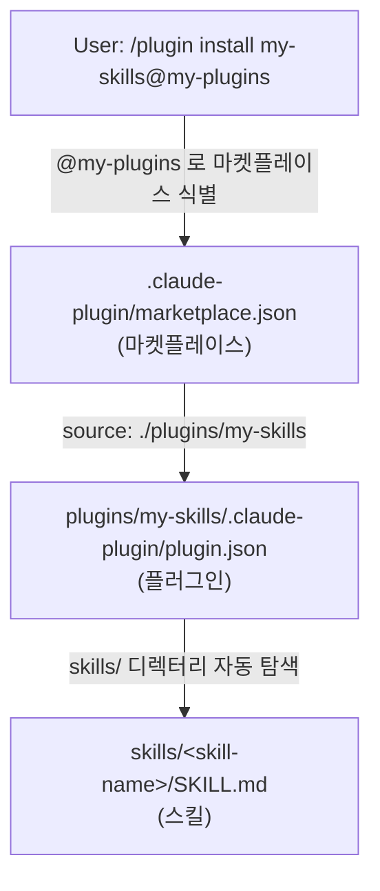
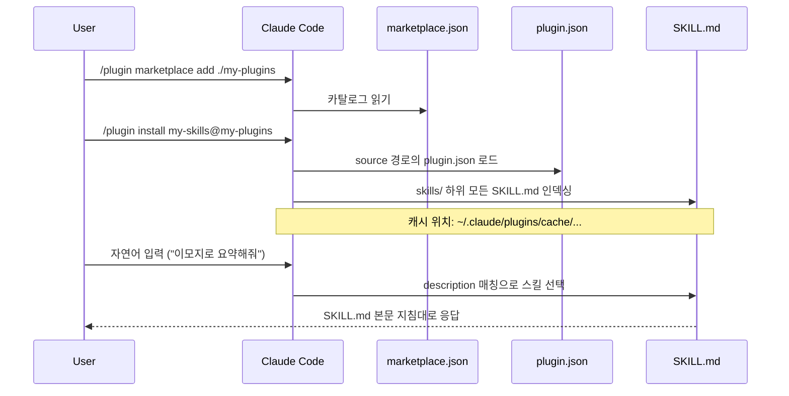

# 아키텍처 · 폴더 구조

`my-plugins` 가 어떻게 구성되어 있고 각 파일이 무슨 역할을 하는지 정리합니다.

## 전체 구조

```
my-plugins/
├── .claude-plugin/
│   └── marketplace.json        # 마켓플레이스 카탈로그 (상위 진입점)
├── plugins/
│   └── my-skills/              # 실제 플러그인 (marketplace.json 의 source)
│       ├── .claude-plugin/
│       │   └── plugin.json     # 플러그인 메타데이터
│       └── skills/
│           ├── emoji-summarizer/
│           │   └── SKILL.md    # 자동 호출되는 스킬
│           └── blank-template/
│               └── SKILL.md    # 새 스킬을 만들 때 복사하는 빈 템플릿
├── docs/                        # 문서 (현재 폴더)
└── README.md
```

## 두 단계 매니페스트 — 마켓플레이스 → 플러그인

Claude Code 의 플러그인 시스템은 **두 단계 메타데이터**로 구성됩니다.



- `marketplace.json` 은 **여러 플러그인의 카탈로그**입니다.
- `plugin.json` 은 **단일 플러그인의 메타데이터**입니다.
- `SKILL.md` 는 **개별 스킬의 본문**입니다.

## marketplace.json 필드

위치: [`.claude-plugin/marketplace.json`](../.claude-plugin/marketplace.json)

| 필드 | 필수 | 설명 |
| --- | --- | --- |
| `name` | 필수 | 마켓플레이스 식별자. `/plugin install my-skills@<name>` 의 `<name>` 으로 사용됨. kebab-case |
| `owner.name` | 필수 | 마켓플레이스 관리자 이름 |
| `owner.email` | 선택 | 관리자 연락처 |
| `metadata.description` | 선택 | 마켓플레이스 한 줄 설명 |
| `metadata.version` | 선택 | 마켓플레이스 자체 버전 |
| `metadata.pluginRoot` | 선택 | 플러그인 source 의 공통 prefix |
| `plugins[]` | 필수 | 플러그인 목록 |
| `plugins[].name` | 필수 | 플러그인 식별자 |
| `plugins[].source` | 필수 | 플러그인 위치. 상대경로(`"./plugins/..."`) 또는 GitHub 객체 |
| `plugins[].version` | 선택 | 플러그인 버전 (semver) |
| `plugins[].description`, `category`, `keywords`, `tags` | 선택 | 검색 / 분류 |

## plugin.json 필드

위치: [`plugins/my-skills/.claude-plugin/plugin.json`](../plugins/my-skills/.claude-plugin/plugin.json)

| 필드 | 필수 | 설명 |
| --- | --- | --- |
| `name` | 필수 | 스킬 네임스페이스 prefix. 호출 시 `/<name>:<skill>` |
| `description` | 필수 | 플러그인 한 줄 설명 |
| `version` | 권장 | semver. 미지정 시 git commit SHA 가 버전이 됨 |
| `author.name` | 선택 | 작성자 |
| `keywords` | 선택 | 검색 태그 배열 |
| `license` | 선택 | 라이선스 식별자 (예: `"MIT"`) |
| `homepage`, `repository` | 선택 | 문서/소스 URL |

## SKILL.md 구조

위치 패턴: `plugins/my-skills/skills/<skill-name>/SKILL.md`

```markdown
---
name: <skill-name>            # 폴더명과 동일하게
description: ...              # 트리거 판단의 핵심
disable-model-invocation: false  # (선택) 자동 호출 차단 시 true
---

# 스킬 제목

## 규칙
...

## 출력 형식
...

## 엣지 케이스
...

## 예시
...
```

핵심 원칙:

- **폴더명 = 스킬명** (호출 시 `/my-skills:<폴더명>`).
- **`description` 은 모델이 이 스킬을 언제 써야 할지 판단하는 첫 번째 신호**입니다. 트리거 키워드 위주로 작성.
- 본문(`# 제목` 이하)은 **모델이 이 스킬을 사용할 때 따라야 할 지침**입니다. 사용자가 보는 화면에는 직접 노출되지 않습니다.

## 데이터 흐름



## 캐시 위치

설치된 플러그인은 다음 위치에 캐시됩니다.

```
%USERPROFILE%\.claude\plugins\cache\my-plugins\<version>\my-skills\
```

소스를 수정해도 캐시는 자동 갱신되지 않습니다. 다음 중 하나로 갱신하세요.

- 개발 중: `claude --plugin-dir ./plugins/my-skills` + `/reload-plugins`
- 마켓플레이스 사용 중: `version` 을 올리고 `/plugin marketplace update my-plugins`

## 흔한 함정

| 함정 | 증상 | 원인 |
| --- | --- | --- |
| `commands/`, `agents/`, `skills/` 를 `.claude-plugin/` 안에 둠 | 스킬이 인식 안 됨 | `.claude-plugin/` 에는 `plugin.json` 만 두어야 함 |
| 폴더명과 frontmatter `name` 불일치 | 슬래시 호출 시 not found | 둘을 동일하게 |
| `version` 변경 없이 카탈로그 갱신 | 사용자 측 업데이트 미반영 | `plugin.json` / `marketplace.json` 의 `version` 을 함께 올림 |
| `source` 경로가 실제로 존재하지 않음 | `marketplace add` 시 에러 | 상대경로가 마켓플레이스 루트 기준인지 확인 |
