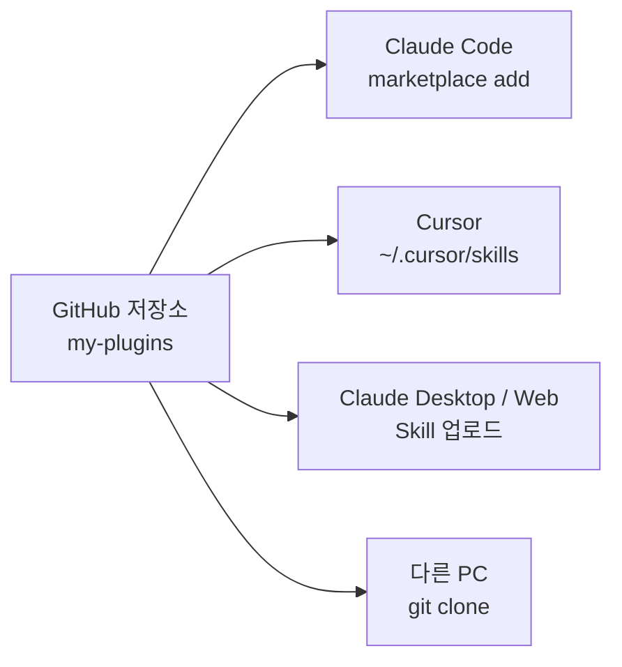

# STEP 2 — 여러 도구에서 사용하기 (안내 응답)

## 사용자 요청 (요약)

> "내가 만든 소스를 사용하고 싶은데 앞으로 여러 도구에서 사용할 수 있는 방법을 알려 줘."

이 단계에서는 **파일 변경은 없었고**, 사용자에게 향후 분배·재사용 전략을 안내했습니다.

## 현재 상태 점검

| 항목 | 상태 |
| --- | --- |
| `my-plugins/` 가 git 저장소인가 | ✗ (아직 init 안 됨) |
| `LICENSE` 파일 | ✗ (`plugin.json` 에 `license: MIT` 만 선언됨) |
| `.gitignore` | ✗ |
| GitHub 원격 | ✗ |

## 제시한 전략 — Git 단일 소스 + 도구별 연결

핵심 아이디어:

> **수정은 `my-plugins/` 한 곳에서만**. 각 도구는 그 저장소를 **링크 / 클론 / 업로드** 중 하나로 가리키게 둔다. 한 번의 변경이 모든 도구에 전파됨.

## 도구별 연결 방법 (요약)

| 도구 | 연결 방법 | 명령 / 위치 |
| --- | --- | --- |
| Claude Code (CLI/Desktop) | 마켓플레이스 등록 | `/plugin marketplace add <user>/my-plugins` → `/plugin install my-skills@my-plugins` |
| Cursor | 심볼릭 링크 (권장) | `~/.cursor/skills/<skill-name>` → `my-plugins/plugins/my-skills/skills/<skill-name>` |
| Cursor (대안) | 복사 | `cp -r .../skills/<name> ~/.cursor/skills/` |
| Claude.ai · Desktop | zip 업로드 | 스킬 폴더를 zip 으로 묶어 [claude.ai/settings/skills](https://claude.ai/settings/skills) 에 업로드 |
| 다른 PC / 팀원 | git clone | `git clone <repo>` 후 위 절차 적용 |

## 권장 진행 순서 (사용자에게 제시)

1. `my-plugins` 를 `git init` → GitHub push (LICENSE, .gitignore 함께)
2. README 에 "GitHub 마켓플레이스 설치" 명령 한 블록 추가
3. Cursor 쓰는 PC 에서 `~/.cursor/skills/` 로 심볼릭 링크 연결
4. 새 스킬 추가/수정은 항상 `my-plugins` 저장소에서만 작업
5. 동기화는 `git pull` + `/reload-plugins` 만으로 끝

## 표준 호환성 검토

**SKILL.md frontmatter (`name`, `description`) 는 사실상 cross-tool 표준입니다:**

- Claude Code: `skills/<name>/SKILL.md` 자동 인덱싱
- Cursor: `~/.cursor/skills/<name>/SKILL.md` 동일 포맷 인식
- Claude.ai web: 업로드 시 동일 frontmatter 파싱
- 기타 Anthropic 호환 도구: 같은 표준

따라서 **한 번 잘 작성한 SKILL.md 는 도구를 옮겨도 그대로 동작**합니다. 도구별로 따로 만들 필요가 없습니다.

## 사용자에게 마지막에 제안한 후속 작업

대화 마지막에 다음 옵션을 제시했고, 사용자가 다음 단계로 [STEP 3](03-docs-folder.md) (docs 폴더 작성)을 선택했습니다.

- [ ] `LICENSE` (MIT) + `.gitignore` 추가 — **보류**
- [ ] README 에 "GitHub 마켓플레이스 설치" 섹션 추가 — **보류**
- [ ] `git init` ~ 첫 커밋 — **보류** (GitHub push 는 본인 계정으로 직접 진행 권장)
- [ ] Cursor 용 심볼릭 링크 스크립트 작성 — **보류**
- [x] docs 폴더에 사용자용 문서 작성 → STEP 3 으로 이행

## 학습 포인트

- **분배 전략은 코드 변경이 아니라 정책 결정**. 작업 전 사용자의 의도(개인용 vs 팀 배포 vs 공개)를 먼저 확인하는 것이 중요.
- **심볼릭 링크는 Windows 에서 관리자 권한 필요** — 사용자 환경별 제약을 명시할 것.
- **Private 저장소는 `gh auth login` 선행 필요** — 권한 흐름을 미리 안내해야 사용자가 막히지 않음.

## 변경된 파일

없음 (안내 응답만 수행).

## 다음 단계

[STEP 3 — docs 폴더 작성](03-docs-folder.md)
