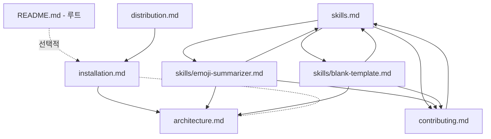

# STEP 3 — docs 폴더 작성

## 사용자 요청 (요약)

> "/docs 폴더를 만들고 설명 파일들을 추가하고 싶다."

## 사용자 결정사항 (AskQuestion)

| 질문 | 선택 |
| --- | --- |
| docs 범위 | **전체 구성 (7개)** — installation / skills / contributing + architecture + distribution + skills/emoji-summarizer + skills/blank-template |
| README.md 와의 관계 | **README 는 그대로 유지, docs/ 는 추가만** |

## 작성한 7개 문서

| # | 파일 | 핵심 내용 |
| --- | --- | --- |
| 1 | [`docs/installation.md`](../installation.md) | 로컬 / GitHub / `--plugin-dir` 세 가지 설치 방법, 업데이트 / 제거 명령, 동작 확인 체크리스트 |
| 2 | [`docs/skills.md`](../skills.md) | 등록된 스킬 표 + 자동 호출 vs 슬래시 호출 차이, `disable-model-invocation` 동작 |
| 3 | [`docs/contributing.md`](../contributing.md) | 새 스킬 추가 7단계 + 체크리스트 + 자주 하는 실수 표 |
| 4 | [`docs/architecture.md`](../architecture.md) | 마켓플레이스 → 플러그인 → 스킬 2단계 매니페스트, 필드 표, 데이터 흐름 다이어그램, 캐시 위치 |
| 5 | [`docs/distribution.md`](../distribution.md) | Git 단일 소스 전략 + Claude Code / Cursor / Claude.ai / 다른 PC 별 연결 방법 |
| 6 | [`docs/skills/emoji-summarizer.md`](../skills/emoji-summarizer.md) | 트리거 키워드, 4개 예시, 엣지 케이스, 잘 안 될 때 점검 포인트, 커스터마이징 아이디어 |
| 7 | [`docs/skills/blank-template.md`](../skills/blank-template.md) | 비활성 트리거 설계 이유, 사용 절차, 골격 섹션 표, 흔한 실수 |

## 문서 간 상호 링크 구조



어느 문서에서 시작하더라도 상호 링크를 따라 전체 docs 를 탐색할 수 있도록 설계했습니다.

## 작성 원칙

각 문서에 일관되게 적용한 패턴:

1. **첫 단락은 한 문장 요약** — 이 문서를 왜 읽는지 즉시 보여줌.
2. **표 / 다이어그램 우선** — 줄글보다 표가 빠르게 읽힘. 흐름이 있으면 mermaid.
3. **"흔한 실수" 또는 "체크리스트" 섹션** — 실전에서 막히는 지점을 명시.
4. **상대 경로 링크** — `../`, `../../` 깊이를 정확히 계산하여 어디서든 동작.
5. **코드펜스 안에는 실행 가능한 명령만** — 설명은 본문에, 명령은 코드 블록에 분리.

## 검증

```
ReadLints                  # 0 errors
Glob "my-plugins/docs/**/*.md"   # 7개 파일 확인
Grep "\\]\\(([^)]+)\\)"   # 모든 마크다운 링크 추출 → 상대 경로 깊이 검증
```

링크 깊이 검증 결과:

| 위치 | `../` 의미 | 검증 |
| --- | --- | --- |
| `docs/skills/<name>.md` → `../../plugins/...` | docs/skills → docs → my-plugins → plugins | 정확 |
| `docs/skills/<name>.md` → `../skills.md` | docs/skills → docs/skills.md | 정확 |
| `docs/architecture.md` → `../.claude-plugin/...` | docs → my-plugins/.claude-plugin | 정확 |
| `docs/distribution.md` → `installation.md` | docs/ 동일 폴더 | 정확 |

## 변경된 파일

| 종류 | 경로 |
| --- | --- |
| 신규 | `docs/installation.md` |
| 신규 | `docs/skills.md` |
| 신규 | `docs/contributing.md` |
| 신규 | `docs/architecture.md` |
| 신규 | `docs/distribution.md` |
| 신규 | `docs/skills/emoji-summarizer.md` |
| 신규 | `docs/skills/blank-template.md` |

루트 `README.md` 는 사용자 결정에 따라 변경하지 않았습니다.

## 학습 포인트

- **사용자 결정 우선**. "README 도 같이 줄일까요?" 옵션을 먼저 물어 README 를 의도치 않게 비우지 않도록 함.
- **분리(separation)가 단지 양 분할이 아님**. `architecture.md` (개발자용) 와 `installation.md` (사용자용) 는 독자층이 다르므로 톤·깊이가 달라야 함.
- **상호 링크가 곧 구조**. 표 / 다이어그램 / 본문 끝 "관련 문서" 세 위치에서 일관되게 링크해 두면 사용자가 막다른 길을 만나지 않음.

## 다음 단계 (선택)

이번 STEP 3 이후 사용자가 추가로 요청한 작업:

- [STEP 4 — Cursor 작업 기록 작성](README.md) (현재 폴더의 인덱스로 이동)

향후 권장 작업 (아직 미수행):

- 루트 `README.md` 에 `docs/` 인덱스 링크 한 줄 추가
- `LICENSE` (MIT) 파일 추가
- `.gitignore` 추가 후 `git init` → 첫 커밋
- Cursor 자동 연결용 PowerShell 스크립트 (`scripts/link-to-cursor.ps1`)
