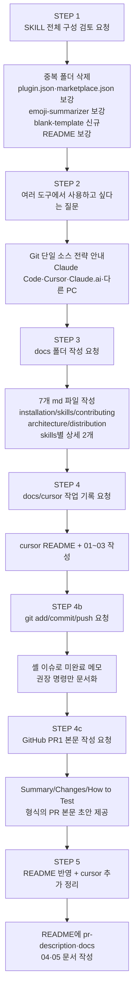

# Cursor 작업 기록

이 폴더는 Cursor IDE 위에서 `my-plugins` 마켓플레이스를 정비하고 문서화한 작업의 흐름을 단계별로 기록합니다.

- 일시: 2026-04-28 (초기 정비) — 이후 대화는 STEP 4~5 문서에 누적
- 작업 환경: Cursor IDE (Windows, e:\apps\claude\my-plugins)
- 모델: Claude (Cursor Agent)

## 한눈에 보는 작업 흐름



## 단계별 문서

| 단계 | 문서 | 한 줄 요약 |
| --- | --- | --- |
| 1 | [01-skill-review-and-cleanup.md](01-skill-review-and-cleanup.md) | 중복 폴더 정리, 메타데이터 표준화, emoji-summarizer 보강, blank-template 추가 |
| 2 | [02-multi-tool-distribution.md](02-multi-tool-distribution.md) | Claude Code·Cursor·Claude.ai·다른 PC 에서 동일 소스 재사용 전략 |
| 3 | [03-docs-folder.md](03-docs-folder.md) | docs/ 폴더에 사용자용 문서 7개 파일 작성 |
| 4 | [04-github-pr1-and-git-request.md](04-github-pr1-and-git-request.md) | git 작업 요청 메모 + [PR #1](https://github.com/kdkim2000/my-plugins/pull/1) 본문 형식 작성 |
| 5 | [05-readme-docs-cursor-sync.md](05-readme-docs-cursor-sync.md) | README 에 pr-description·docs 반영, cursor 인덱스 및 본 STEP 문서화 |

> STEP 4(작업 기록)의 상세는 [03-docs-folder.md](03-docs-folder.md) 끝의 "STEP 4" 언급과 본 README 의 mermaid Q4~A4 를 참고.

## 결과 요약

이 저장소를 거치며 만들어진 주요 산출물 구조(요약):

```
my-plugins/
├── .claude-plugin/
│   └── marketplace.json            # metadata, 플러그인 version 1.1.0 등
├── docs/
│   ├── installation.md
│   ├── skills.md
│   ├── contributing.md
│   ├── architecture.md
│   ├── distribution.md
│   ├── skills/
│   │   ├── emoji-summarizer.md
│   │   └── blank-template.md
│   └── cursor/
│       ├── README.md               # ← 인덱스 (본 파일)
│       ├── 01-skill-review-and-cleanup.md
│       ├── 02-multi-tool-distribution.md
│       ├── 03-docs-folder.md
│       ├── 04-github-pr1-and-git-request.md
│       └── 05-readme-docs-cursor-sync.md
├── plugins/my-skills/
│   ├── .claude-plugin/
│   │   └── plugin.json             # version 1.1.0, PR 스킬 설명
│   └── skills/
│       ├── emoji-summarizer/SKILL.md
│       ├── pr-description/
│       │   ├── SKILL.md
│       │   └── evals/evals.json
│       └── blank-template/SKILL.md
└── README.md
```

## 이 기록을 남기는 이유

- **재현성:** 같은 종류의 작업을 다른 플러그인에 적용할 때 그대로 따라할 수 있는 절차서로 활용.
- **결정 추적:** 왜 중복 폴더 중 `./plugins/my-skills` 를 정식 위치로 선택했는지, 왜 marketplace.json 의 description 을 `metadata.description` 으로 옮겼는지 등 결정 근거를 함께 남김.
- **온보딩:** 이 저장소를 처음 보는 협업자가 어떤 흐름으로 정비됐는지 한 번에 파악.

## 관련 문서

- 사용자용 가이드는 상위 폴더 [`../`](../) 의 문서들을 참고하세요.
- 변경된 매니페스트의 의미는 [`../architecture.md`](../architecture.md) 에 정리되어 있습니다.
- 루트 요약 README: [`../../README.md`](../../README.md)
