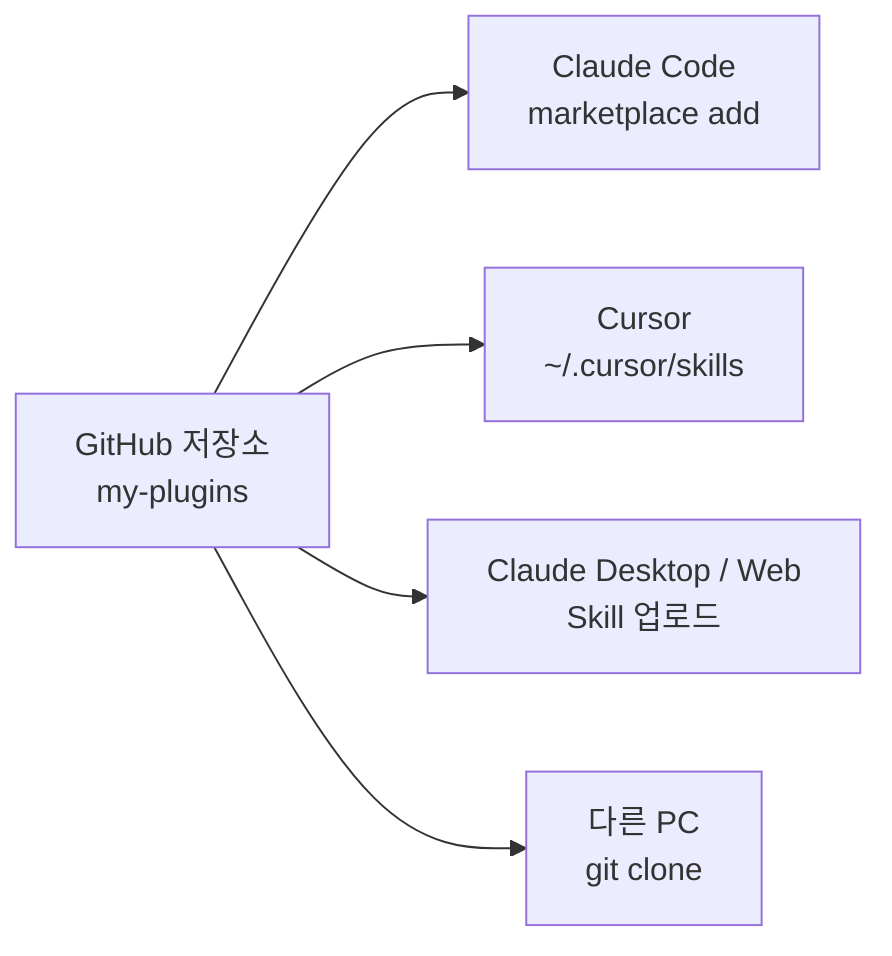

# 여러 도구 · 여러 PC 에서 사용하기

`my-plugins` 한 벌을 만들어 두면 Claude Code 외의 도구에서도 같은 스킬을 재사용할 수 있습니다. 핵심 전략은 **Git 저장소를 단일 소스로 두고, 각 도구는 그 저장소를 가리키게(또는 심도록) 만드는 것**입니다.



## 1단계 — Git 저장소로 만들고 GitHub 에 올리기

```bash
cd my-plugins
git init
git add .
git commit -m "chore: initial my-plugins marketplace"
gh repo create <github-username>/my-plugins --public --source=. --push
```

권장 추가 파일:

- `LICENSE` — `plugin.json` 의 `license` 와 일치 (현재 MIT 로 선언됨)
- `.gitignore` — `.DS_Store`, `*.log`, IDE 설정 등 제외

## 2단계 — 도구별 사용 방법

### A. Claude Code (CLI · Desktop)

가장 자연스러운 사용처입니다. 자세한 내용은 [installation.md](installation.md) 를 참고하세요.

- 로컬 경로: `/plugin marketplace add E:\apps\claude\my-plugins`
- GitHub: `/plugin marketplace add <github-username>/my-plugins`
- 설치: `/plugin install my-skills@my-plugins`

### B. Cursor — `~/.cursor/skills/` 에 SKILL.md 직접 배치

Cursor 는 SKILL.md frontmatter 형식을 그대로 인식합니다. 두 가지 방법:

**방법 1) 심볼릭 링크 (권장 — 단일 소스 유지)**

Windows PowerShell **관리자 권한**:

```powershell
New-Item -ItemType SymbolicLink `
  -Path "$env:USERPROFILE\.cursor\skills\emoji-summarizer" `
  -Target "E:\apps\claude\my-plugins\plugins\my-skills\skills\emoji-summarizer"
```

이후 저장소를 `git pull` 하면 Cursor 에도 자동 반영됩니다.

macOS / Linux:

```bash
ln -s "$PWD/my-plugins/plugins/my-skills/skills/emoji-summarizer" \
      "$HOME/.cursor/skills/emoji-summarizer"
```

**방법 2) 복사 (간단하지만 동기화 수동)**

```bash
cp -r my-plugins/plugins/my-skills/skills/emoji-summarizer ~/.cursor/skills/
```

전역 대신 **프로젝트 단위**로만 쓰고 싶다면 워크스페이스 루트의 `.cursor/skills/` 에 두면 됩니다.

### C. Claude Desktop · Claude.ai (web)

Anthropic 의 웹 Skills 업로더는 **개별 스킬 폴더(zip)** 단위로 받습니다.

```bash
cd my-plugins/plugins/my-skills/skills/emoji-summarizer
zip -r ../emoji-summarizer.zip .
```

생성된 `emoji-summarizer.zip` 을 [claude.ai/settings/skills](https://claude.ai/settings/skills) 에 업로드하면 됩니다. SKILL.md 본문은 그대로 동작합니다.

### D. 다른 PC · 팀원 — `git clone` 한 번이면 끝

```bash
git clone https://github.com/<github-username>/my-plugins.git
# Claude Code 세션 안에서:
#   /plugin marketplace add ./my-plugins
#   /plugin install my-skills@my-plugins
# Cursor 도 쓴다면:
#   심볼릭 링크 또는 복사로 ~/.cursor/skills 연결
```

## 3단계 — 운영 팁

| 항목 | 권장 사항 |
| --- | --- |
| 버전 관리 | 새 스킬 / 본문 변경 시 `plugin.json` 과 `marketplace.json` 의 `version` 을 함께 올림 (semver) |
| 변경 반영 | Claude Code 안에서 `/reload-plugins` (코드 수정 시), 카탈로그 갱신은 `/plugin marketplace update my-plugins` |
| 팀 배포 | Public 저장소면 `<user>/<repo>` 한 줄로 누구나 설치 가능. Private 면 `gh auth login` 후 동일 |
| 표준 호환성 | SKILL.md frontmatter (`name`, `description`) 는 Claude Code · Cursor · Claude.ai 공용 표준. 한 번 잘 써두면 도구를 옮겨도 그대로 동작 |
| 동기화 전략 | "원본은 항상 my-plugins 저장소" 원칙을 지키고, 다른 도구로의 배포는 심볼릭 링크 또는 zip 빌드 스크립트로 자동화 |

## 권장 워크플로우 한 줄 요약

> **수정은 `my-plugins/` 에서만**. 각 도구는 이 저장소를 **링크 / 클론 / 업로드** 중 하나로 가리키게 둔다. 그러면 한 번의 변경이 모든 도구에 전파된다.
